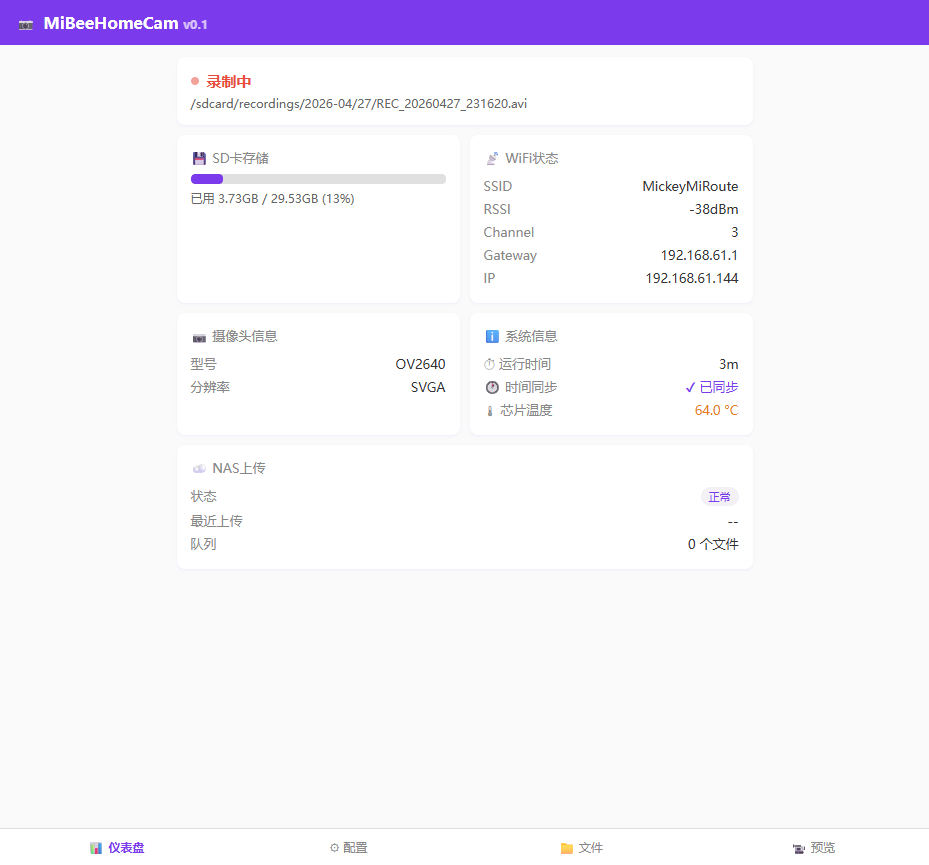
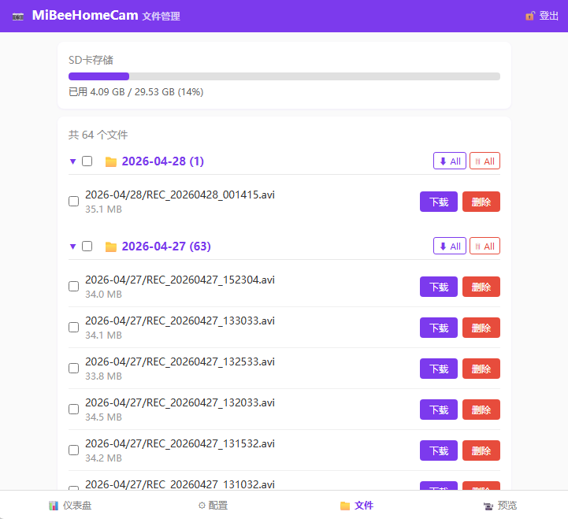
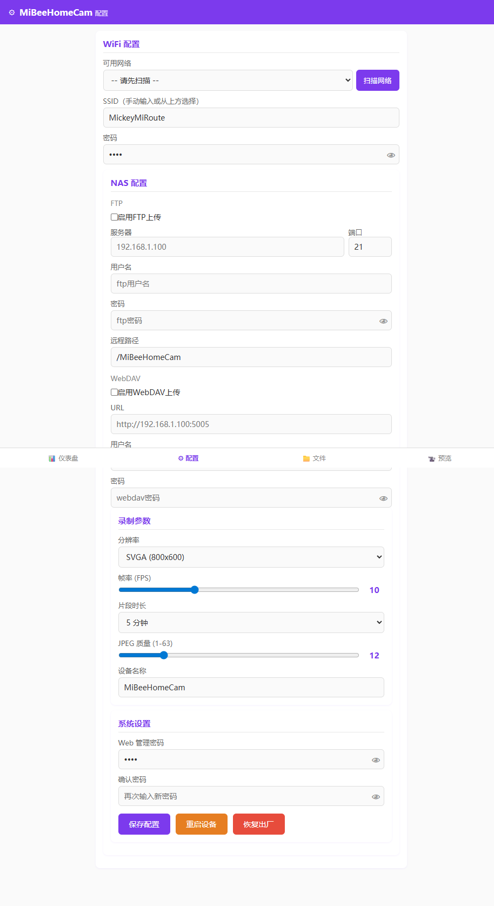

## MiBeeHomeCam - ESP32-S3 摄像头监控

> 基于 XIAO ESP32-S3 Sense 的智能监控摄像头固件

[English](README.md) | 中文文档

基于 ESP32-S3 的监控摄像头固件，支持 MJPEG 实时流、AVI 分段录像、NAS 自动上传。使用 ESP-IDF 开发，针对 8MB Octal PSRAM 优化，在资源受限的嵌入式环境下稳定运行实时视频采集与传输。

## 功能亮点

- 📹 MJPEG 实时视频流，浏览器直接查看
- 🎬 AVI 自动分段录像，循环存储不担心空间
- ☁️ FTP / WebDAV 自动上传至 NAS
- 📡 WiFi AP/STA 双模式，即插即用
- 🌐 REST API + Web 管理界面
- 💾 TF 卡热插拔，自动恢复录像
- 🔍 OV2640 / OV3660 自动检测
- 🛡️ 看门狗 + 健康监控，长期稳定运行
- 🌡️ ESP32-S3 芯片温度监测，Web 仪表盘实时显示
- 📊 Prometheus `/metrics` 端点，支持外部监控系统对接
- 📁 批量文件操作：多选、下载、删除
- 🎨 Mi\&Bee 紫色主题，全站统一视觉风格
- 🚀 GitHub Actions CI/CD，自动构建发布固件

## Web 管理界面


*仪表盘 — 实时状态总览*

内置 Web 管理界面，提供完整的设备管理功能：

- **📊 仪表盘** — 录像状态、WiFi 信息、存储用量、芯片温度
- **⚙ 配置** — WiFi、视频参数、NAS 上传设置
- **📁 文件** — 浏览、下载、批量删除录像文件，支持按日期折叠
- **📹 预览** — 浏览器内实时 MJPEG 视频流




## 快速开始

```bash
git clone https://github.com/Mi-Bee-Studio/esp32s3-cam.git
cd esp32s3-camera
idf.py build
idf.py -p COM3 flash monitor
```

需要 ESP-IDF v5.x 或 v6.0 开发环境。👉 [详细安装指南](docs/zh/getting-started.md)

## 硬件要求

[XIAO ESP32-S3 Sense](https://wiki.seeedstudio.com/xiao_esp32s3_getting_started/) 开发板 + 板载 OV2640/OV3660 摄像头 + TF 卡（FAT32，Class 10+）

👉 [硬件详情与引脚定义](docs/zh/hardware.md)

## 文档

| 文档                                 | 说明               |
| ---------------------------------- | ---------------- |
| [安装指南](docs/zh/getting-started.md) | 环境搭建、编译烧录、首次配置   |
| [硬件手册](docs/zh/hardware.md)        | 引脚定义、硬件规格、接线说明   |
| [使用手册](docs/zh/user-guide.md)      | 配置管理、LED 指示、存储策略 |
| [系统架构](docs/zh/architecture.md)    | 启动流程、模块架构、数据流    |
| [故障排除](docs/zh/troubleshooting.md) | 常见问题、调试方法        |
| [API 参考](docs/zh/api/overview.md)  | REST API 完整文档    |

## API 速览

| 方法   | 路径                               | 说明                       |
| ---- | -------------------------------- | ------------------------ |
| GET  | `/api/status`                    | 设备状态（录像、WiFi、存储、摄像头、温度）  |
| GET  | `/stream`                        | MJPEG 实时视频流              |
| POST | `/api/config`                    | 修改配置（需认证）                |
| POST | `/api/record?action=start\|stop` | 录像控制（需认证）                |
| GET  | `/api/files`                     | 录像文件列表                   |
| GET  | `/api/download?name=xxx`         | 下载录像文件                   |
| POST | `/api/files/batch`               | 批量删除文件（需认证）              |
| GET  | `/metrics`                       | Prometheus 监控指标（text 格式） |

默认管理密码：`admin`。👉 [完整 API 文档](docs/zh/api/overview.md)

## 项目结构

```
esp32s3-camera/
├── main/                 # 固件源码（14 个 C 模块）
│   ├── main.c            # 入口，19 步启动流程
│   ├── camera_driver.c   # 摄像头驱动（OV2640/OV3660）
│   ├── video_recorder.c  # AVI 录像引擎
│   ├── mjpeg_streamer.c  # MJPEG 实时流
│   ├── web_server.c      # HTTP 服务器 + REST API
│   ├── nas_uploader.c    # NAS 上传调度
│   ├── wifi_manager.c    # WiFi AP/STA 管理
│   ├── config_manager.c  # NVS 配置持久化
│   ├── storage_manager.c # SD 卡 + 循环清理
│   ├── status_led.c      # LED 状态机（5 种模式）
│   ├── time_sync.c       # SNTP 时间同步
│   ├── ftp_client.c      # FTP 协议客户端
│   ├── webdav_client.c   # WebDAV 协议客户端
│   └── web_ui/           # Web 管理界面（4 页面）
├── docs/                 # 项目文档
│   ├── en/               # 英文文档
│   └── zh/               # 中文文档
├── partitions.csv        # 分区表（factory 3.5MB + SPIFFS 256KB）
└── sdkconfig.defaults    # XIAO ESP32-S3 Sense 默认配置
```

## 许可证

[GNU General Public License v3.0](LICENSE)

本项目采用 GNU General Public License v3.0 许可证。详情请参阅 [LICENSE](LICENSE) 文件。

您可以在遵守许可证条款的前提下，自由使用、修改和分发本软件。
