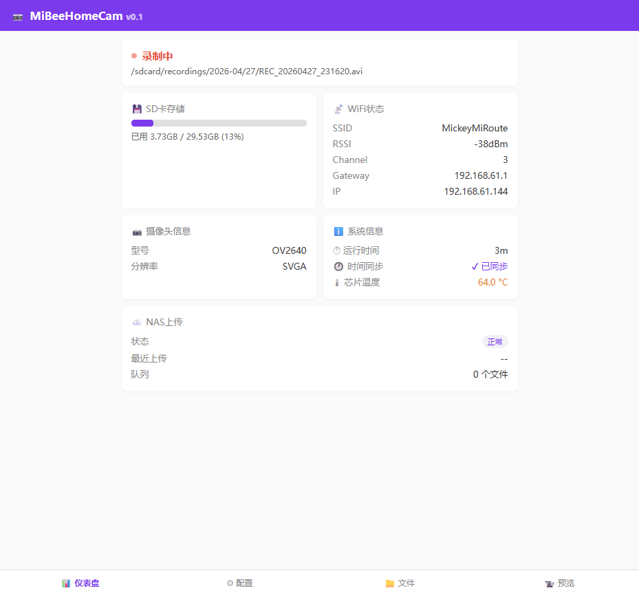
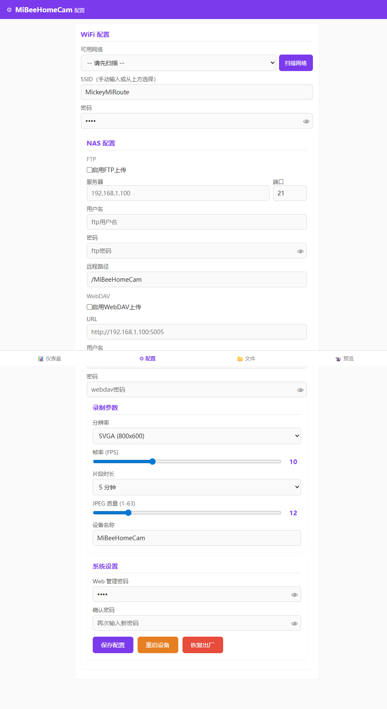
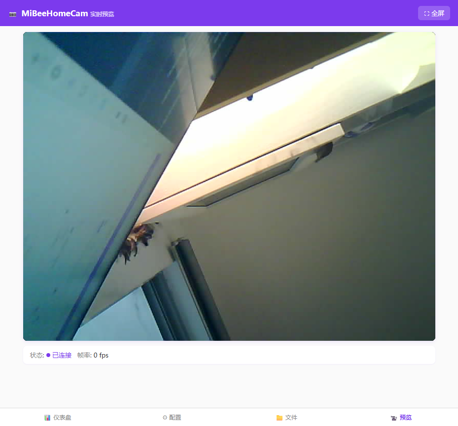

# 使用手册

> ESP32-S3 摄像头监控固件的日常使用指南

## 概述

本文档介绍 ESP32-S3 摄像头监控固件的日常使用方法，包括 Web 管理界面操作、配置参数说明、录像与存储管理、NAS 上传等功能。

## Web 管理界面

设备内置 HTTP 服务器，提供 Web 管理界面和 REST API。

### 访问地址

| 模式 | 地址 |
|------|------|
| AP 模式 | `http://192.168.4.1` |
| STA 模式 | `http://<设备IP>` |

- AP 模式：连接 WiFi 热点 `MiBee Cam-XXXX`（密码 `12345678`），然后访问 `http://192.168.4.1`
- STA 模式：设备连接路由器后，通过路由器分配的 IP 访问

### 登录密码

默认管理密码：`mibeecam2026`。涉及写操作的 API 请求需要通过 `X-Password` 请求头或 `?password=xxx` 查询参数传递密码。

### 页面说明

| 页面 | 功能 |
|------|------|
| index | 状态总览（录像状态、WiFi、存储、摄像头型号、运行时间） |
| config | 配置管理（WiFi、录像、NAS 上传等全部参数） |
| preview | 实时视频预览（浏览器内 MJPEG 流） |
| files | 录像文件管理（浏览、下载、删除） |
| ota | 固件远程升级（上传固件或从 URL 更新） |
| setup | 首次配置向导（自动引导 WiFi 设置） |

### 仪表盘页面



仪表盘显示实时设备状态：录像状态、当前文件、WiFi 连接、SD 卡用量、摄像头型号、芯片温度和运行时间。通过 WebSocket 实时推送，无需刷新页面。

### 配置页面



所有设备参数均可在此修改：WiFi 凭据、视频分辨率/帧率/画质、录像分段时长、WebDAV/HTTP(S) 上传设置、摄像头翻转和系统密码。

### 文件管理页面


按日期组织的录像文件浏览。支持折叠展开日期分组、批量选择、文件夹级下载/删除和持久化登录认证。

### 视频预览页面



浏览器内直接查看实时 MJPEG 视频流，最多支持 2 个同时观看的客户端。

## 配置管理

### 通过 Web 界面

打开 `config` 页面，直接修改各项参数并保存。修改后立即生效，同时持久化到 NVS 闪存。

### 通过 API

使用 `POST /api/config` 接口修改配置，需附带 `X-Password` 认证：

```bash
# 修改 WiFi
curl -X POST http://192.168.4.1/api/config \
  -H 'Content-Type: application/json' -H 'X-Password: mibeecam2026' \
  -d '{"wifi_ssid":"MyWiFi","wifi_pass":"mypassword"}'

# 修改视频参数
curl -X POST http://192.168.4.1/api/config \
  -H 'Content-Type: application/json' -H 'X-Password: mibeecam2026' \
  -d '{"resolution":1,"fps":10,"jpeg_quality":12,"segment_sec":300}'
```

> 密码字段传 `"****"` 表示不修改，传实际值则更新。

### 完整配置参数表

#### WiFi 配置

| 参数 | 类型 | 默认值 | 说明 |
|------|------|--------|------|
| `wifi_ssid` | string | `""` | WiFi 名称，为空则进入 AP 模式 |
| `wifi_pass` | string | `""` | WiFi 密码 |
| `wifi_ssid_2` | string | `""` | WiFi 备份 SSID（AP 回退） |
| `wifi_pass_2` | string | `""` | WiFi 备份密码 |
| `allow_ap_fallback` | bool | `true` | WiFi 失败时允许回退到 AP 模式 |
#### 设备配置

| 参数 | 类型 | 默认值 | 说明 |
| `device_name` | string | `"MiBee Cam"` | 设备名称 |
| `web_password` | string | `"admin"` | Web 管理密码 |

#### 上传方式配置

| `upload_method` | uint8 | `0` | 上传方式：0=禁用, 1=WebDAV, 2=HTTP(S) |
| `upload_base_path` | string | `"/MiBee Cam"` | 上传基础路径 |
| `webdav_url` | string | `""` | WebDAV 服务器 URL |
| `webdav_user` | string | `""` | WebDAV 用户名 |
| `webdav_pass` | string | `""` | WebDAV 密码（GET 请求返回 `****`） |
| `webdav_enabled` | bool | `false` | 是否启用 WebDAV 上传 |
| `http_upload_url` | string | `""` | HTTP(S) 上传完整 URL |
| `http_upload_user` | string | `""` | HTTP(S) 用户名 |
| `http_upload_pass` | string | `""` | HTTP(S) 密码（GET 请求返回 `****`） |
| `http_upload_skip_cert_verify` | bool | `false` | 跳过 HTTPS 证书验证 |

#### 摄像头配置

| 参数 | 类型 | 默认值 | 说明 |
|------|------|--------|------|
| `vflip` | bool | `false` | 垂直翻转 |
| `hmirror` | bool | `false` | 水平镜像 |
#### 视频配置

| 参数 | 类型 | 默认值 | 说明 |
|------|------|--------|------|
| `resolution` | uint8 | `1` | 分辨率：0=VGA(640×480), 1=SVGA(800×600), 2=XGA(1024×768) |
| `fps` | uint8 | `10` | 帧率，范围 1-30 |
| `segment_sec` | uint16 | `300` | 录像分段时长（秒） |
| `jpeg_quality` | uint8 | `12` | JPEG 画质，1-63，数值越低画质越好 |
#### 录像配置

| 参数 | 类型 | 默认值 | 说明 |
|------|------|--------|------|
| `timelapse_mode` | uint8 | `0` | 录像模式：0=连续, 1=普通延时, 2=动态延时 |
| `timelapse_interval_sec` | uint16 | `0` | 延时拍摄间隔（0=连续, 1-300=延时秒数） |

#### 运动检测配置

| 参数 | 类型 | 默认值 | 说明 |
|------|------|--------|------|
| `motion_sensitivity` | uint8 | `30` | 运动检测灵敏度 0-100（越大越灵敏） |
| `motion_active_interval_sec` | uint8 | `2` | 动态模式：有运动时拍摄间隔（秒） |
| `motion_idle_interval_sec` | uint16 | `60` | 动态模式：无运动时拍摄间隔（秒） |
| `frame_drop_enabled` | bool | `false` | 资源压力下启用丢帧功能 |

#### 存储配置

| 参数 | 类型 | 默认值 | 说明 |
|------|------|--------|------|
| `cleanup_low_pct` | uint8 | `20` | 自动清理时可用空间 < 此百分比时触发 |
| `cleanup_high_pct` | uint8 | `30` | 可用空间 > 此百分比时停止清理 |

#### 告警配置

| 参数 | 类型 | 默认值 | 说明 |
|------|------|--------|------|
| `alert_webhook_url` | string | `""` | 告警 webhook URL，用于 HTTP 回调通知 |
| `alert_webhook_enabled` | bool | `false` | 启用告警 webhook 通知 |

## LED 指示灯

板载 LED（GPIO21，低电平有效）通过不同闪烁模式反映设备当前状态：

| 模式 | LED 表现 | 含义 |
|------|----------|------|
| LED_STARTING | 常亮 | 系统启动中 |
| LED_AP_MODE | 慢闪（1 秒周期） | AP 热点模式，等待配置 |
| LED_WIFI_CONNECTING | 快闪（200ms 周期） | 正在连接 WiFi |
| LED_RUNNING | 熄灭 | 正常运行，录像中 |
| LED_ERROR | 双闪 | 错误状态（SD 卡故障等） |

**双闪时序详解**（LED_ERROR）：

```
ON 200ms → OFF 200ms → ON 200ms → OFF 1000ms → 循环
|← 第1次闪烁 →|← 第2次闪烁 →|←  长间隔   →|
```

## WiFi 配置

### AP 模式

设备首次启动或未配置 WiFi 时自动进入 AP 模式：

- SSID：`MiBee Cam-XXXX`（XXXX 为 MAC 地址后 4 位十六进制）
- 密码：`12345678`
- IP 地址：`192.168.4.1`
- 加密方式：WPA2-PSK
- 最大连接数：4

### 切换到 STA 模式

配置 `wifi_ssid` 和 `wifi_pass` 后重启，设备自动连接路由器。设置后需重启切换模式。

### 自动重连

STA 模式下断开后，设备每 60 秒自动尝试重连，无需手动干预。

### WiFi 漫游

设备支持基于 RSSI 阈值的主动 WiFi 漫游：

- **RSSI 阈值**（`wifi_roam_rssi_threshold`）：当当前信号低于此值（默认：-75 dBm）时，设备尝试寻找更好的 AP。设置为 `0` 可禁用漫游。
- **RSSI 信号差值**（`wifi_roam_rssi_gap`）：切换前所需的信号差值（默认：10 dBm）。防止在信号强度相近的 AP 之间振荡切换。

通过配置页面 → WiFi 部分配置，或通过 API：

```json
{"wifi_roam_rssi_threshold": -70, "wifi_roam_rssi_gap": 8}
```
STA 模式下断开后，设备每 60 秒自动尝试重连，无需手动干预。

## 录像管理

### 自动录像

设备启动后，如果 SD 卡就绪，会自动开始录像。

### 手动控制

通过 API 手动开始或停止录像：

```bash
# 开始录像
curl -X POST "http://192.168.4.1/api/record?action=start" \
  -H "X-Password: mibeecam2026"

# 停止录像
curl -X POST "http://192.168.4.1/api/record?action=stop" \
  -H "X-Password: mibeecam2026"
```

### 录像格式


- **格式**：AVI（MJPEG 编码）
- **分段**：按 `segment_sec`（默认 300 秒 = 5 分钟）自动分段
- **文件命名**：`REC_YYYYMMDD_HHMMSS.avi`（如 `REC_20260424_143000.avi`）
- **存储路径**：`/sdcard/recordings/YYYY-MM/DD/`（按日期分目录）
- **延时摄影模式**：当 `timelapse_interval_sec > 0` 时，文件使用 `TLM_` 前缀，15fps 播放

每个分段完成后自动触发：NAS 上传 → 存储清理 → 开启下一段。

### 录像模式

设备支持三种录像模式，通过 `timelapse_mode` 控制：

| 模式 | 说明 | 存储消耗 |
|------|------|----------|
| 连续录像（0） | 标准 AVI 分段录像 | 最高（全帧率） |
| 普通延时（1） | 固定间隔拍摄，15fps AVI 播放 | 低（约 1/间隔倍数） |
| 动态延时（2） | 运动自适应：有运动时快速拍摄，无运动时慢速 | 最低（安静时段节省 90%+） |

动态延时是核心功能。设置 timelapse_mode=2，调节运动灵敏度（motion_sensitivity，0-100），
运动检测自动切换拍摄间隔：有运动时按 motion_active_interval_sec（默认 2 秒）高频拍摄，
无运动时按 motion_idle_interval_sec（默认 60 秒）低频拍摄。适用于停车场、仓库、3D 打印机等场景。

## 存储管理

### 录像路径

```
/sdcard/recordings/
├── 2026-04/
│   ├── 24/
│   │   ├── REC_20260424_080000.avi
│   │   ├── REC_20260424_080500.avi
│   │   └── ...
│   └── 25/
│       └── ...
```

### 循环存储


当 SD 卡剩余空间不足时自动清理：

- **低于 `cleanup_low_pct`（默认 20%）**：开始删除最早的录像文件
- **持续清理直到 `cleanup_high_pct`（默认 30%）**：每次分段录像完成后检查
- **写入失败恢复**：写入失败时，录像器尝试清理+重试
- **安全限制**：单次清理最多删除 100 个文件

### 启动清理

设备启动时会自动扫描 `/sdcard/recordings/` 目录，删除 RIFF 头大小为 0 的不完整 AVI 文件（通常是异常断电导致）。

### SD 卡热插拔

设备每 10 秒检测一次 SD 卡状态：

| 事件 | 行为 |
|------|------|
| SD 卡拔出 | 停止当前录像，LED 显示错误状态 |
| SD 卡插入 | 重新挂载，自动恢复录像，LED 恢复正常 |

## NAS 上传

### 上传方式配置

通过 `upload_method` 字段选择上传方式（互斥，只能选一种）：

| 值 | 方式 | 说明 |
|----|------|------|
| `0` | 禁用 | 不上传，仅本地 SD 卡存储 |
| `1` | WebDAV | 使用 WebDAV 协议上传到 NAS |
| `2` | HTTP(S) | 使用 HTTP PUT 上传，支持 HTTPS |
#### WebDAV 上传配置

| 参数 | 说明 |
|------|------|
| `webdav_url` | WebDAV 服务器完整 URL |
| `webdav_user` | WebDAV 用户名 |
| `webdav_pass` | WebDAV 密码 |
| `webdav_enabled` | 设为 `true` 启用（需配合 `upload_method=1`） |

#### HTTP(S) 上传配置

| 参数 | 说明 |
|------|------|
| `http_upload_url` | HTTP(S) 上传完整 URL |
| `http_upload_user` | HTTP(S) 用户名 |
| `http_upload_pass` | HTTP(S) 密码 |
| `http_upload_skip_cert_verify` | 跳过 HTTPS 证书验证（自签名证书时设为 `true`） |
| `upload_base_path` | 上传基础路径（默认 `/MiBee Cam`） |

**互斥说明**：上传方式只能选一种，不能同时启用。切换方式后，之前的上传配置仍然保留在 NVS 中，但不会被使用。

### 上传队列

- 队列容量：16 个文件
- 每个文件最多重试 3 次
- 连续失败 10 次后暂停上传 5 分钟
- 后台任务异步处理，不影响录像

### 查看上传状态

```bash
curl http://192.168.4.1/api/status
```

返回 `upload_queue`（待上传数）和 `last_upload`（上次上传时间）。

## OTA 固件升级

设备支持远程固件升级，无需连接串口线。

### 通过 Web 界面

1. 打开 OTA 页面（/ota.html）
2. 输入固件下载 URL 或直接上传 .bin 文件
3. 点击更新按钮，等待升级完成
4. 设备自动重启

### 通过 API

```bash
curl -X POST http://192.168.4.1/api/ota -H "Content-Type: application/json" -H "X-Password: mibeecam2026" -d '{"url":"https://example.com/firmware/mibee_cam.bin"}'
```

当前固件版本：v0.4.0，可在仪表盘页面查看。

## TF 卡配置覆盖

设备启动时会读取 SD 卡上的配置文件，优先级高于 NVS 中保存的配置。

### wifi.txt

路径：`/sdcard/config/wifi.txt`

```
SSID=你的WiFi名称
PASS=你的WiFi密码
```

## Webhook 通知

设备支持通过 HTTP 回调（Webhook）发送事件通知：

| 事件类型 | 触发条件 |
|----------|----------|
| motion_detected | 运动检测触发（动态延时模式） |
| recording_error | 录像异常 |
| system_startup | 设备启动完成 |

在配置页面设置 alert_webhook_url 和启用 alert_webhook_enabled 后，
事件发生时设备会向该 URL 发送 POST 请求：

```json
{"event_type": "motion_detected", "message": "检测到运动"}
```

## WebSocket 实时推送

仪表盘页面使用 WebSocket 实时更新状态（录像状态、运动事件等），无需手动刷新页面。
### nas.txt

路径：`/sdcard/config/nas.txt`

UPLOAD_METHOD=webdav
WEBDAV_URL=https://dav.example.com/path
WEBDAV_USER=user
WEBDAV_PASS=pass
WEBDAV_ENABLED=false
HTTP_UPLOAD_URL=
HTTP_UPLOAD_USER=
HTTP_UPLOAD_PASS=
HTTP_UPLOAD_SKIP_CERT=true
UPLOAD_BASE_PATH=/MiBee Cam
```

以 `#` 开头的行会被忽略。

### 配置优先级

```
TF 卡配置文件 > NVS 闪存 > 默认值
```

从 TF 卡读取的配置会同步写回 NVS，确保一致性。

## OTA 固件升级

设备通过 Web 界面（`/ota.html`）支持三种 OTA 升级模式：

1. **URL 触发** — 输入固件下载 URL，设备获取并刷新
2. **固件上传** — 通过 Web 浏览器直接上传 `.bin` 固件文件
3. **SPIFFS 上传** — 上传 `spiffs.bin` 镜像以更新 Web UI 页面

所有更新均经过 SHA-256 校验。更新后，设备重启并运行自检（摄像头初始化检查）。如果自检失败，固件会自动回滚到上一个版本。

**API 触发**（仅 URL 模式）：

```bash
curl -X POST http://192.168.4.1/api/ota \
  -H "Content-Type: application/json" \
  -H "X-Password: mibeecam2026" \
  -d '{"url":"https://example.com/firmware/mibee_cam.bin"}'
```

当前固件版本：v0.4.0

## 视频流

### 浏览器查看

直接在浏览器中打开：

```
```
http://<设备IP>:81/stream
```
```

### 客户端限制

最多支持 **2 个**同时连接的流客户端。超过限制时返回 503 错误。


### ONVIF 发现

摄像头支持 ONVIF WS-Discovery 协议，可以被 NVR 系统（网络录像机）自动发现。设备使用标准 ONVIF 发现消息在网络中宣告自己，与大多数专业监控系统兼容。

有关详细的 ONVIF 配置和集成，请参阅 ONVIF 文档和您的 NVR 系统手册。

### 调整画质

通过 `POST /api/config` 修改视频参数：

| 参数 | 可选值 | 说明 |
|------|--------|------|
| `resolution` | 0, 1, 2 | VGA(640×480)、SVGA(800×600)、XGA(1024×768) |
| `fps` | 1-30 | 帧率，越高越流畅但占用更多带宽 |
| `jpeg_quality` | 1-63 | 画质，数值越低画质越好（建议 10-20） |

### 摄像头翻转设置

通过 `POST /api/config` 修改摄像头翻转方向：

```bash
curl -X POST http://192.168.4.1/api/config \
  -H 'Content-Type: application/json' -H 'X-Password: mibeecam2026' \
  -d '{"vflip":true,"hmirror":true}'
```

| 参数 | 说明 |
|------|------|
| `vflip` | 垂直翻转（上下颠倒） |
| `hmirror` | 水平镜像（左右翻转） |

> ⚠️ 翻转设置对**新采集的帧**立即生效。已录制的 AVI 文件不受影响。建议在停止录像后修改翻转设置。
## 时间管理

### 自动同步

STA 模式下设备启动后会自动通过 NTP 同步时间：

- 服务器：`cn.pool.ntp.org`、`ntp.aliyun.com`
- 同步超时：5 秒（超时后异步继续）

### 手动设置

```bash
curl -X POST http://192.168.4.1/api/time \
  -H "Content-Type: application/json" \
  -H "X-Password: mibeecam2026" \
  -d '{"year":2026,"month":4,"day":24,"hour":14,"min":30,"sec":0}'
```

## 恢复出厂设置

### 方法一：BOOT 按钮

按住 BOOT 按钮（GPIO0）**5 秒**，设备会自动恢复出厂设置并重启。

### 方法二：Web 界面

在 Web 配置页面点击"恢复出厂设置"按钮。

### 方法三：API

```bash
curl -X POST http://192.168.4.1/api/reset \
  -H "X-Password: mibeecam2026"
```

### 恢复结果

所有配置参数恢复为默认值（WiFi 清空、密码重置为 `mibeecam2026`），设备重启后进入 AP 模式。TF 卡中的录像文件不会被删除。

---

## 功能互斥与资源限制

### ⚠️ 上传方式互斥
上传方式（upload_method）只能选择一种：禁用、WebDAV 或 HTTP(S)。切换方式后，之前的上传配置仍然保留在 NVS 中，但不会被使用。

### ⚠️ 视频流并发限制
系统共有 2 个视频流消费者共享摄像头帧缓冲：
1. **录像任务** (recording_task) — Core 0，最高优先级
2. **MJPEG HTTP 流** (/stream) — 最多 2 个客户端
- 正常使用：录像 + 1 个 HTTP 流客户端
- 建议不同时开启多个 HTTP 流客户端
- 录像任务优先级最高，不会因流客户端增加而丢帧

### ⚠️ 翻转设置不影响已录制的视频

vflip/hmirror 设置对**新采集的帧**立即生效，但：
- 录像过程中可以切换翻转，但同一段视频内可能出现方向不一致的帧
- 建议在停止录像后修改翻转设置

### ⚠️ 上传方式从旧版本升级
如果从旧版本（支持 FTP）升级，设备会自动迁移 NVS 配置：
- 旧 `ftp_enabled=true` → `upload_method=1`（WebDAV）

## Prometheus 监控

设备提供 `/metrics` 端点，包含 15 个系统指标的文本 exposition 格式，供外部监控系统使用。

### 访问指标

```bash
curl http://192.168.4.1/metrics
```

### 可用指标

- `system_uptime_seconds`: 设备运行时间
- `recording_status`: 当前录像状态（0=停止, 1=录像中）
- `wifi_strength_dbm`: WiFi 信号强度
- `sdcard_used_bytes`: SD 卡已用空间
- `sdcard_free_bytes`: SD 卡可用空间
- `chip_temp_celsius`: ESP32-S3 芯片温度
- `upload_queue_size`: 待上传文件数
- `total_recorded_files`: 总录像文件数
- `fps_current`: 当前每秒帧数
- `memory_free_bytes`: 可用堆内存
- `memory_psram_free_bytes`: 可用 PSRAM 内存
- `heap_watermark_bytes`: 堆水位线（最低可用）
- `stack_watermark_bytes`: 栈水位线（最低可用）

### 温度监控

ESP32-S3 芯片温度可通过 `/api/status` 获取，Web 仪表板带有颜色编码指标：
- **< 40°C**: 绿色（正常）
- **40-60°C**: 黄色（较热）
- **> 60°C**: 红色（过热）
- 旧 `webdav_enabled=true` → `upload_method=1`（WebDAV）
- 旧 FTP 相关 NVS 键值会被自动删除
